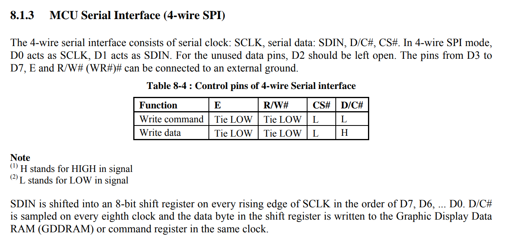
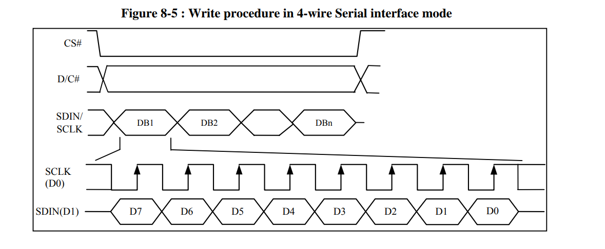
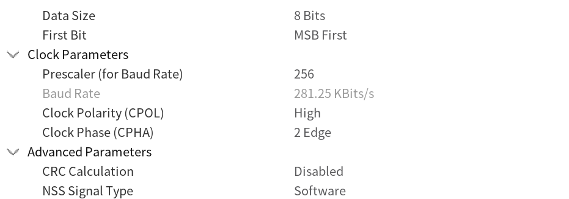

# SPI

##接线

在SPI总线中，一共规定了4条线，分别含义如下:

* SCLK —串行时钟同步输出，同步数据传输，使用主机输出；
* MOSI —主机输出从机输入，主机通过该线发送数据，从机通过该线接收数据；
* MISO —主机输入从机输出，主机通过该线接收数据，从机通过该线发送数据；
* CS(NSS) —片选，主机输出，用来选中具体的从机。 cs拉低开启通信，拉高结束

### 注：
1. SPI会有主从机（或者对于MCU来说会有主模式，从模式）之分，它的区分依据是SCLK同步时钟和SS片选是由谁输出，输出方就会被定义为工作在主机（主模式）状态下。
2. 如果在一个系统中只含有一个采用SPI通信的外设，那么我们可以将外设的SS引脚直接连接板子的GND引脚，这样使得外设始终被选中，从而节省了连接线。

<https://blog.csdn.net/renqingxin2011/article/details/91047802>

<https://blog.csdn.net/as480133937/article/details/105849607>

## CubeMX
#### Mode：主机从机全双工半双工
#### hardware NSS ：硬件片选
    * enable 开启:开启后不用手动在通讯开始前拉低CS 猜测：一对一时主从机都可以开启，一对多时主机不能开启 主机选output从机选input
    * disable：需要手动在spi通讯开始前拉低CS CS的Pin要在GPIO里手动设置 一对多时需要主机定义多个pin作为 cs1 cs2 ..
#### First Bit:一个字节中,先发送哪一位
    * LSB first: 小端在前
    * MSB first: 大端在前 in the order of D7, D6, ... D0
    
* 选择lsb还是msb由连接的硬件决定,ADDR[31:0]就是MSB first的方式，如果标记为ADDR[0:31]就是LSB first的方式。
    <https://blog.csdn.net/weixin_42868654/article/details/88577851>

#### Prescaler(分频)[Rate频率]
    根据硬件选择,不能超过硬件的相关频率
#### CPOL 时钟极性
    时钟空闲时的高低
#### CPHA(edge) 时钟相位

1 edge:时钟改变的第一个边沿采样

* CPOL和CPHA根据连接的硬件时序图选择

## 代码

### HAL_SPI_TransmitReceive()  发同时收
### 注意：transmit一次最好只发一个，否则进不了中断

## 例子： spi1 和 spi2通信

    #include "start.h"
    #include "main.h"
    #include "gpio.h"
    #include "usart.h"
    #include "spi.h"
    #include <string>
    using namespace std;
    
    string str;
    uint8_t t[8] = {1,2,3,4,5,6,7,8};
    uint8_t text[10];
    int count =0;
    
    void setup()
    {
        HAL_SPI_Receive_IT(&hspi3,text,8);
        while(1)
        {
            for(uint8_t i=0; i<=7;i++)
            {
                //注意&
                HAL_SPI_Transmit(&hspi2,(uint8_t *) &t[i],1,100);
            }
            HAL_Delay(500);
        }
    }
    
    void HAL_SPI_RxCpltCallback(SPI_HandleTypeDef *hspi)
    {
    
        HAL_GPIO_TogglePin(LD2_GPIO_Port,LD2_Pin);
        count++;
        str = "i heard ";
        for(int i=0;i<=9;i++)
        {
            str+=",";
            str += to_string(text[i]);
    
        }
        str += to_string(count);
        HAL_UART_Transmit(&huart2,(uint8_t *)str.data(),str.size(),100);
        HAL_SPI_Receive_IT(&hspi3,text,8);
    
    }

# SPI驱动12864oled(ssd 1306)
资料:

* [原理图](./References/0.96-7pin_spi_sch.pdf)
* [数据手册](./References/0.96寸7针SPI模块.pdf)
* [数据手册(ssd1306)](./References/SSD1306.pdf)

## 接线 

4线spi,注意,spi模式的0.96oled背面 R1 R2 R8没有电阻

## CubeMX:spi1

* spi模式: transmit only master
* 由数据手册,可知选择MSP
* 由时序图,选择 时钟极性1,2边沿
* 速度可达到9M

设置如下

## 代码

[oled.cpp](../Mylibs/oled_12864/oled.cpp)

[oled.h](../Mylibs/oled_12864/oled.h)

[oledfont.h](../Mylibs/oled_12864/oledfont.h)